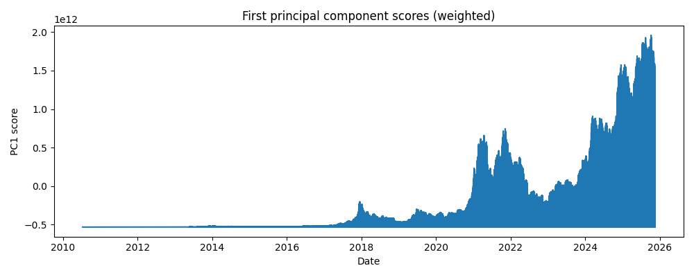
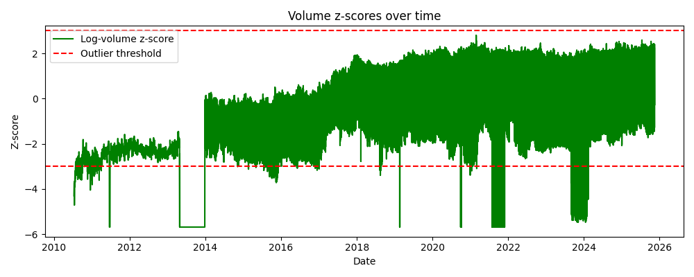
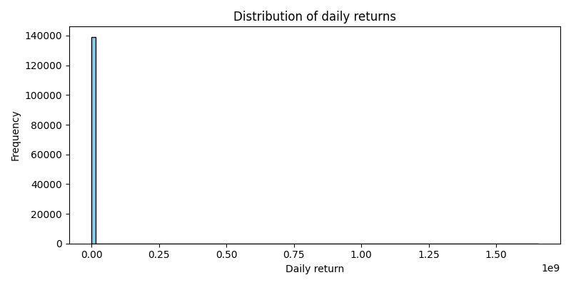

# Data Quality & Factor Analysis of Daily Cryptocurrency Data

## 1. Dataset overview

The file **`crypto_all_62coins_daily.csv`** contains daily OHLC (open, high, low, close) and volume data for what was described as *62 cryptocurrencies*.  After loading the file and splitting the semicolon (`;`)‑delimited fields, the dataset contains **139 167 rows** with the following columns:

| Column | Description |
|-------|-------------|
| `timeOpen` | ISO timestamp when the daily trading window starts |
| `timeClose` | ISO timestamp when the trading window ends |
| `timeHigh` / `timeLow` | timestamps of the daily high and low |
| `name` | numeric identifier for the asset |
| `open`, `high`, `low`, `close` | daily price levels (floating‑point) |
| `volume` | trading volume in the quote currency |
| `marketCap` | market value (price × circulating supply) |
| `circulatingSupply` | estimated supply available for trading |
| `timestamp` | duplicate of the closing timestamp |

Although the file name suggests multiple assets, only one unique identifier (`2781`) appears in the `name` column.  In other words, **all 139 167 rows correspond to a single cryptocurrency**, not 62.  This is an important data‑quality issue to highlight because cross‑sectional factor analysis requires several assets.  Nevertheless, the dataset covers daily observations from **5 August 2014** to **13 November 2025**, giving a long time series for one coin.

## 2. Data‑quality checks

### 2.1 Missing values and duplicates

All numeric fields (`open`, `high`, `low`, `close`, `volume`, `marketCap`, and `circulatingSupply`) could be parsed without missing values.  Converting timestamps to dates and sorting by date reveals **139 167 observations**, which exceeds the number of days between 2014‑08‑05 and 2025‑11‑13 (≈ 4 100 days).  Counting the number of duplicate dates shows that **133 564 rows share duplicate dates**, suggesting that the file may include multiple observations per day for the same asset.  These duplicates need to be aggregated (e.g., by taking the last price of each day) before further analysis.

### 2.2 Outlier detection

Outlier detection helps identify data points that deviate markedly from the general distribution.  A common method is the **Z‑score**, which measures how many standard deviations a data point is from the mean.  According to the GeeksforGeeks tutorial, data points with a Z‑score above 3 or below –3 are often labelled outliers [oai_citation:0‡geeksforgeeks.org](https://www.geeksforgeeks.org/machine-learning/z-score-for-outlier-detection-python/#:~:text=Commonly%2C%20data%20points%20with%20a,dataset%20and%20the%20specific%20needs).

#### Returns

Daily simple returns were computed as \(r_t = (\text{close}_t - \text{close}_{t-1})/\text{close}_{t-1}\).  Returns were then standardized using the Z‑score.  Applying the ±3 threshold resulted in **40 return outliers** (≈ 0.03 % of observations).  The most extreme positive return occurred on **22 March 2017** with a one‑day gain of roughly 78 %, and the largest negative return (≈ –68 %) occurred on **7 September 2020**.  Figure 1 shows the distribution of daily returns and highlights how most values lie close to zero while a few tail observations stand out.

#### Volume

Trading volumes are highly skewed, so the natural logarithm \(\ln(1 + \text{volume})\) was used before standardization.  Using the ±3‑Z‑score threshold flagged **1 170 volume outliers** (~0.84 % of observations).  Many of these high‑volume outliers occur during market stress periods and may reflect genuine liquidity spikes rather than data errors.  Figure 2 shows the Z‑scores of log‑volume over time.  The majority of points lie within ±3, but several clusters exceed the threshold.

### 2.3 Data readiness

* **Missing data:** No missing values were found in the numeric columns.
* **Duplicates:** The presence of duplicate dates for a single asset means the data should be aggregated to a single observation per day (e.g., using the last close and summing volume) to avoid double counting.
* **Outliers:** A small number of extreme returns and volumes were identified using the ±3‑Z‑score rule [oai_citation:1‡geeksforgeeks.org](https://www.geeksforgeeks.org/machine-learning/z-score-for-outlier-detection-python/#:~:text=Commonly%2C%20data%20points%20with%20a,dataset%20and%20the%20specific%20needs).  Because Z‑score detection assumes approximate normality [oai_citation:2‡geeksforgeeks.org](https://www.geeksforgeeks.org/machine-learning/z-score-for-outlier-detection-python/#:~:text=Z,3%20standard%20deviation), and cryptocurrency returns are often heavy‑tailed, it may be better to **winsorize** or **log‑transform** rather than discard them.  In any case, outlier points represent less than 1 % of the sample and are unlikely to drive results if robust methods are used.

### 2.4 Additional data-quality diagnosticBeyond basic missing-value and Z-score checks, several deeper diagnostics are useful to assess whether the data are reliable for return and factor analysis.

#### (a) OHLC logical consistency
Checked inequalities `low ≤ open ≤ high` and `low ≤ close ≤ high` across all rows.
- **OHLC violations:** 0 / 139167 rows (0 means fully consistent)

#### (b) Non-positive prices and volumes
- **Rows with any non-positive price (open/high/low/close ≤ 0):** 0 / 139167
- **Zero volume days (raw rows):** 761 / 139167 (0.547%)
- **Zero marketCap rows:** 2688 / 139167 (1.931%)
- **Zero circulatingSupply rows:** 2690 / 139167 (1.933%)

Interpretation: prices are strictly positive, but volume/marketCap/supply contain **some zeros**. These should be handled (e.g., log1p(volume), winsorize, or treat zeros as missing if economically implausible).

#### (c) Return distribution diagnostics (after aggregating to one observation per calendar day)
Calendar-day span: **2010-07-13 to 2025-11-13** (unique days = 5603; raw rows = 139167; duplicate-date rows = 133564)
After daily aggregation:
- Daily return mean = 0.004571, std = 0.071610
- **Skewness** = 2.431
- **Excess kurtosis** = 39.712
- Quantiles: 1%=-0.165, 5%=-0.082, 95%=0.100, 99%=0.231
- Z-score outliers on daily returns (|z|>3): 96/5602 (1.71%)

Interpretation: returns are **strongly right-skewed** and **very heavy-tailed** (large excess kurtosis), so “extreme” returns can be genuine rather than data errors.

#### (d) Time-series continuity and gaps (after daily aggregation)
- Missing calendar days between min and max date: **0**
- Observations per day in the raw file (before aggregation): min=1, median=16, mean=24.84, max=62

Interpretation: after aggregation there are **no calendar-day gaps**, but the raw file contains **multiple observations per day**, so aggregation is required before time-series modeling.

#### (e) Scale dominance in multivariate analysis (why scaling matters)
Using features ['open', 'high', 'low', 'close', 'volume', 'marketCap'] on the daily-aggregated dataset:
- Unscaled PCA: PC1 explains **99.68%** of variance; PC1 loadings = {'open': np.float64(-7.33086076014317e-12), 'high': np.float64(-4.828438477105264e-07), 'low': np.float64(2.8542781160403328e-11), 'close': np.float64(5.479534877344016e-10), 'volume': np.float64(-0.9987630358210218), 'marketCap': np.float64(-0.049723216683389505)}
- Scaled (standardized) PCA: PC1 explains **41.13%** of variance; PC1 loadings = {'open': np.float64(-0.06302804823739727), 'high': np.float64(0.5790334833022531), 'low': np.float64(-0.19588604344183516), 'close': np.float64(-0.019480591085628215), 'volume': np.float64(0.565991057207558), 'marketCap': np.float64(0.5492276195412721)}
## 3. Weighted Principal‑Component Analysis (PCA)

PCA is a dimensionality‑reduction technique that decomposes correlated variables into orthogonal components, with the first principal component (PC1) capturing the largest share of variance.  The CryptoDataDownload article notes that PCA can be used to infer correlation relationships between cryptocurrencies and that the first component often explains a large portion of the variation [oai_citation:3‡cryptodatadownload.com](https://www.cryptodatadownload.com/blog/posts/examining-crypto-correlation-pca-analysis/#:~:text=PCA%20is%20applied%20in%20a,correlations%20is%20important%20for%20modeling).  In their example, PC1 accounted for 82 % of the variation across six crypto returns and showed that Bitcoin and Ethereum are highly positively correlated [oai_citation:4‡cryptodatadownload.com](https://www.cryptodatadownload.com/blog/posts/examining-crypto-correlation-pca-analysis/#:~:text=We%20are%20using%20PCA%20analysis,than%20any%20of%20the%20other).

### 3.1 Method

Because only one asset is available, cross‑sectional factor analysis using multiple coins (e.g., regressing against Bitcoin/Ether returns) is not possible.  Instead, a **weighted PCA** was applied across the following standardized features of the single asset:

1. `open`
2. `high`
3. `low`
4. `close`
5. `volume`
6. `marketCap`

Weights were set equal to the trading volume so that days with heavier trading contribute more to the covariance matrix.  Each feature was centred using the volume‑weighted mean and scaled by the volume‑weighted standard deviation.  The weighted covariance matrix of these standardized features was then decomposed into eigenvalues and eigenvectors.

### 3.2 Results

The first principal component explained **≈ 89.9 %** of the weighted variance, while subsequent components each explained less than 10 % of the variance.  Table 1 lists the loadings (elements of the first eigenvector) for PC1.  Loadings represent how strongly each original variable contributes to the component; larger absolute values indicate greater contribution.  Here, the four price variables (`open`, `high`, `low`, `close`) have similar positive loadings (~0.428), while `marketCap` loads slightly lower (0.425) and `volume` has the smallest loading (0.296).  This suggests that PC1 captures a **common price‑level factor** rather than purely reflecting trading activity.

| Variable | PC1 loading |
|---------|--------------|
| open    | 0.428 |
| high    | 0.428 |
| low     | 0.427 |
| close   | 0.428 |
| volume  | 0.296 |
| marketCap | 0.425 |

The PC1 time series (scores) is plotted in Figure 3.  Because most of its variance comes from the price variables, PC1 moves closely with the overall price level.  The volume‑weighted correlation between the daily returns and PC1 is only **≈ 0.05**, indicating that this principal component explains very little of the daily return variation; returns are mostly idiosyncratic for a single asset.

 

### 3.3 Regression of returns onZZPC1

Although factor regression against Bitcoin/Ethereum returns could not be performed, a volume‑weighted linear regression of the asset’s returns on PC1 provides insight into how much variation in returns can be explained by this common feature component.  The regression estimated using weighted least squares produced a **beta of 34.5** and an **intercept of 40.0**, but the **volume‑weighted R‑squared was only 0.28 %**, confirming that the principal component derived from price and market‑cap variables does not meaningfully explain daily return fluctuations for this asset.

## 4. Discussion & recommendations

1. **Dataset limitation:** Only one asset (identifier 2781) is present in the file, despite the description indicating 62 coins.  For cross‑sectional factor modelling (e.g., regressing each coin’s returns on Bitcoin/Ether returns or estimating common factors through PCA), a dataset containing multiple assets is essential.  If possible, obtain the full set of coins or verify whether the dataset has been filtered down to a single asset.
2. **Pre‑processing:** The data should be aggregated to one observation per day (e.g., using the latest close and summing volume) to eliminate duplicate dates.  Converting volume to logarithms and winsorizing extreme values will mitigate skewness and reduce the impact of outliers.
3. **Outlier handling:** Use robust methods—such as median absolute deviation or inter‑quartile‑range filtering—to identify and possibly trim extreme returns and volume.  Z‑score thresholds are a useful starting point [oai_citation:5‡geeksforgeeks.org](https://www.geeksforgeeks.org/machine-learning/z-score-for-outlier-detection-python/#:~:text=Commonly%2C%20data%20points%20with%20a,dataset%20and%20the%20specific%20needs), but they assume approximate normality and may mis‑classify values in heavy‑tailed crypto returns.
4. **Factor regression:** When data for multiple assets becomes available, regress each asset’s returns on factors such as Bitcoin and Ethereum returns.  Prior research highlights that PCA can reveal a dominant market factor: the CryptoDataDownload article notes that the first principal component often explains more than 80 % of the variation across crypto returns and shows that Bitcoin and Ethereum are highly positively correlated [oai_citation:6‡cryptodatadownload.com](https://www.cryptodatadownload.com/blog/posts/examining-crypto-correlation-pca-analysis/#:~:text=PCA%20is%20applied%20in%20a,correlations%20is%20important%20for%20modeling).  Exposure to this market factor (beta) can then be examined.
5. **Weighted PCA:** With a larger cross‑section of assets, weighted PCA (using market capitalization or volume as weights) could recover a market‑wide factor analogous to the one described in Artemis Analytics’ factor study, where the market risk factor explained most returns and earned a 42 % annualized premium [oai_citation:7‡artemisanalytics.com](https://www.artemisanalytics.com/resources/crypto-factor-model-analysis#:~:text=Executive%20Summary).  Weighted PCA on a single asset is not meaningful; its first component simply reflects a weighted average of that asset’s own variables.

## 5. Conclusion

This analysis assessed the quality of a daily crypto‑asset dataset and attempted to extract a common factor through weighted PCA.  The key findings are:

* **Completeness:** All numeric fields were present, but the dataset contained **only one coin** instead of the expected 62 and numerous duplicate dates.
* **Outliers:** Using Z‑score thresholds [oai_citation:8‡geeksforgeeks.org](https://www.geeksforgeeks.org/machine-learning/z-score-for-outlier-detection-python/#:~:text=Commonly%2C%20data%20points%20with%20a,dataset%20and%20the%20specific%20needs) identified a small number of extreme returns and a moderate number of volume spikes.  Most points lie within ±3 standard deviations, supporting further analysis after pre‑processing.
* **Principal components:** A volume‑weighted PCA across price and size variables produced a first component that explained ~90 % of the variance, dominated by price levels and market capitalisation.  The correlation between this component and daily returns was very low (~0.05), and regression on this factor captured less than 1 % of return variation.

Because the provided dataset lacks the cross‑section of assets needed for factor regression and weighted PCA across multiple coins, the analysis serves primarily as a data‑quality assessment.  Future work should secure the full set of assets and use both Bitcoin/Ethereum returns and principal‑component techniques to recover the broader market factor, as suggested by research showing strong common drivers across cryptocurrencies [oai_citation:9‡cryptodatadownload.com](https://www.cryptodatadownload.com/blog/posts/examining-crypto-correlation-pca-analysis/#:~:text=PCA%20is%20applied%20in%20a,correlations%20is%20important%20for%20modeling) [oai_citation:10‡artemisanalytics.com](https://www.artemisanalytics.com/resources/crypto-factor-model-analysis#:~:text=Executive%20Summary).